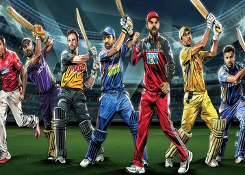

# Web Scraping and Linear Programming with Premier League

The Premier League is the highest level of the Indian cricket. 10 teams play each season.

Premier League is the most-watched sports league in the India.

The idea of this project is using Web Scraping to collect the data, and then apply Linear programming to find optimal 11 players.

The data is from the season 2023 from ESPN Crick info. We have data related to the teams and to the players.

The main keys of this project are:
* Web Scraping to collect the data.
* A little Exploratory Data Analysis and Data Cleaning.
* Optimizing using Linear Programming.

### requirements
1. pandas
2. pulp

if pulp is not installed:
use `pip install pulp` to install

### run
`python pulp_model.py`

# Making Dream Team
- outputs: 11 optimal players

## Objective
The objective is to use linear programming in a real world application. 
We are trying to make a team that satifies all the constrain and maximise the total expected points 

### references
- https://towardsdatascience.com/creating-a-fantasy-cricket-team-application-of-linear-programming-4b60c261702d
